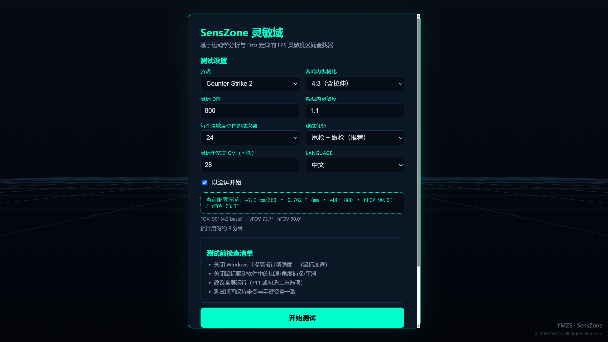
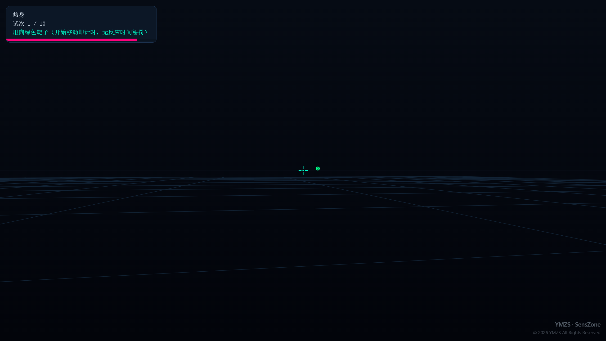
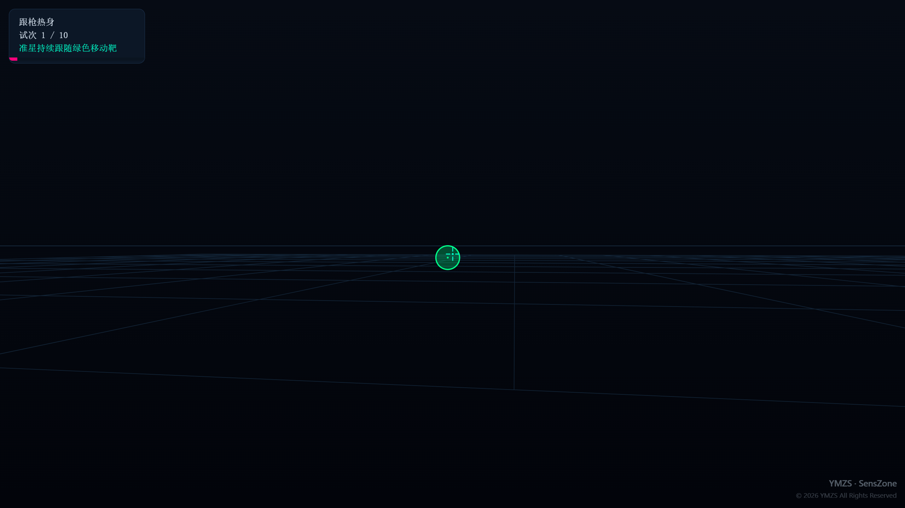
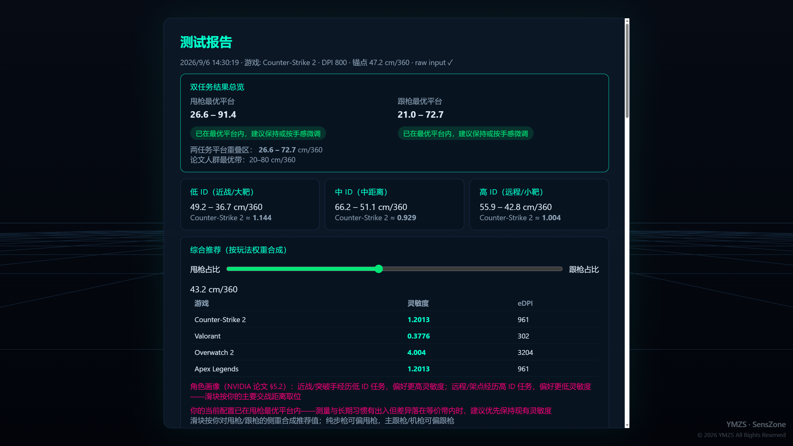
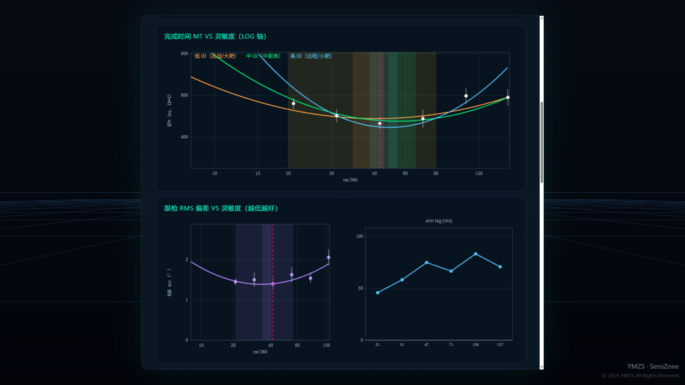

# SensZone（灵敏域）v1.4.1

[](https://github.com/YimingZhanshen/SensZone/actions/workflows/ci.yml)

基于运动学分析与 Fitts 定律的 FPS 灵敏度区间查找器。任务范式与统计口径对齐 NVIDIA 论文《Mouse Sensitivity Effects in First-Person Targeting Tasks》（Boudaoud et al.）。

**© 2026 YMZS** · 个人使用与内容创作免费；修改再分发需署名原作者、同协议开源并附完整源码，改进优先提 Pull Request 回上游；商用需授权。详见 [LICENSE](LICENSE)（场景内含 YMZS 水印与版权标识）。

输出**个人最优灵敏度平台区间**（甩枪/跟枪双任务画像），而不是伪精确的单点数值。

> **🌐 在线使用：<https://senszone.yimingzhanshen.cn/>**

## 界面预览

| 菜单 | 测试中（甩枪） | 测试中（跟枪） |
| :---: | :---: | :---: |
|  |  |  |
| **报告总览与综合推荐** | **诊断图表** | |
|  |  | |

更多报告细节（四相时间分解 / 端点误差 / 风格画像）见 `docs/USER-MANUAL.md`。

## 快速开始

1. **在线使用（推荐）**：打开 <https://senszone.yimingzhanshen.cn/>，Chrome/Edge 双击进入全屏
2. **本地打开（离线备选）**：双击仓库中的 `index.html`（file:// 协议同样完整可用）
3. 填写设置：游戏、游戏内纵横比、鼠标 DPI、当前游戏内灵敏度、测试任务（默认：甩枪+跟枪）；
   未预设的游戏可选 Custom 并直接输入该游戏的 yaw 值（°/count，可查社区换算表）
4. 按《测试前检查清单》关闭系统/驱动鼠标加速
5. 勾选"以全屏开始"→ 开始测试
6. 全程约 9–11 分钟（24 试次/条件 + 6×15s 跟枪），可随时 ESC 暂停，进度自动保存

## 可安装 / 离线使用

- 网站为 PWA：在 Chrome/Edge 地址栏可"安装"为独立应用（开始菜单/桌面启动，无浏览器边框）
- 安装或首次访问后资源已缓存，**断网刷新可完整进入菜单并开始测试**
- 发版说明：`sw.js` 缓存版本号与 `SZ.VERSION` 手动同步（见 `AGENTS.md` 发版约定）

## 测试任务

- **离散甩枪（flick）**：视角自动回中 → 靶子出现（灰色预览）→ **开始移动鼠标即计时**
  （速度阈值检测，无反应时间惩罚）→ 甩向靶子单击（1.5s 超时判失败）
- **跟踪（tracking）**：准星持续跟随平滑随机移动的绿色靶子 15 秒，
  测 RMS 偏差、在靶时间、准星滞后毫秒数（速度互相关）
- 两个任务共用 6 个灵敏度条件（锚点 ×0.3/0.44/0.67/1.0/1.5/2.25，对数间隔），顺序随机
- **协议**：每条件丢弃前 1/3 试次、只统计命中试次的 MT、
  靶子按论文矩阵采样（5 宽度 × 5 距离带 → ID 0.83–5.50 bits）

## 报告怎么读

- **双任务总览**：甩枪最优平台 + 跟枪最优平台 + 重叠区；每档"调整后成绩差异 <8%"视为等价
- **综合推荐**：权重滑块（甩枪占比 0–100%）按你的玩法合成推荐值 + 多游戏换算表
- **统计口径**：MT 经 ANCOVA 难度归一（ID=3.0 bits 基准）+ 加权二次拟合 + bootstrap 置信区间，
  消除"某条件恰好抽到简单靶"的运气偏差
- **诊断图**：带符号端点误差（正=过冲，负=欠冲）、子动作数（论文 Algorithm 1）、跟枪 RMS 曲线
- **历史趋势**：菜单"历史"区显示历次推荐值趋势小图，每条记录标注与最新一次推荐值的相差百分比
- **导出**：JSON 原始数据（供复测对比/存档）与品牌化 PNG 分享图（含最优区间、综合推荐与多游戏换算表）
- **物理约束**：填写垫宽后校验 180° 转身是否 ≤ 垫宽 45%
- 最终定档前，建议在游戏死斗中用平台中心验证 1–2 周

## 精度与保真设计

- `requestPointerLock({ unadjustedMovement: true })`：尽力请求原始鼠标数据，
  不支持时明确警告（结果可能受系统加速污染）
- `getCoalescedEvents()`：高频鼠标（8kHz）不丢采样
- 全程 delta-time，帧率无关（60Hz 与 360Hz 公平）
- FOV 换算正确：CS2 的 90° 为 4:3 基准水平 FOV（垂直 ≈73.74°，16:9 水平 ≈106.26°）；
  目标全部以**角度**定义，分辨率/纵横比无关
- 指标：MT、吞吐量 ID/MT（Shannon 公式）、σ(MT)、命中率、子动作数
  （论文 Algorithm 1：5 阶 7Hz Butterworth，V_start=8°/s，V_end=4°/s，T_min=80ms）

## 已知局限

- 浏览器无法 100% 保证绕过 OS 鼠标加速（已在报告中标注输入模式）
- 简化场景：无武器模型/压枪/移动瞄准；未覆盖 180° 大转身与开镜
- 单 session 统计功效有限（每条件 16 有效试次 vs 论文 250）——报告已标注置信度

## 开发

欢迎贡献！流程与约定见 [CONTRIBUTING.md](CONTRIBUTING.md)（PR 为首选贡献方式，三关全绿：lint + smoke + flow）。

```
src/
  math.js        灵敏度换算 / Fitts ID / 球面几何 / 种子随机
  kinematics.js  重采样 + Butterworth + 论文 Algorithm 1 子动作分割
  stats.js       加权二次拟合 / bootstrap / Spearman
  i18n.js        zh-CN / en
  render.js      Canvas 2D 渲染（无第三方依赖）
  input.js       Pointer Lock(raw) + coalesced events
  task-flick.js  离散甩枪任务状态机（自动回中 + 移动起始计时）
  task-track.js  跟枪任务（正弦叠加轨迹 + RMS/滞后度量）
  session.js     条件生成 / 双任务调度 / 断点续测
  analysis.js    ANCOVA 归一 + 加权拟合 + 平台检测 + 报告生成
  charts.js      MT 曲线 / 跟枪 RMS 曲线 / 诊断图
  ui.js / main.js 界面与装配
test/smoke.cjs   数学/算法/渲染契约冒烟测试：node test/smoke.cjs
test/flow.cjs    全会话集成测试（flick 命中流 / 脱靶流 / 双任务流）：node test/flow.cjs
```

设计依据见 `docs/DEVELOPMENT.md`。默认设置按作者环境预填：CS2 / 4:3 / 800 DPI / 1.15（≈45.2 cm/360）。
